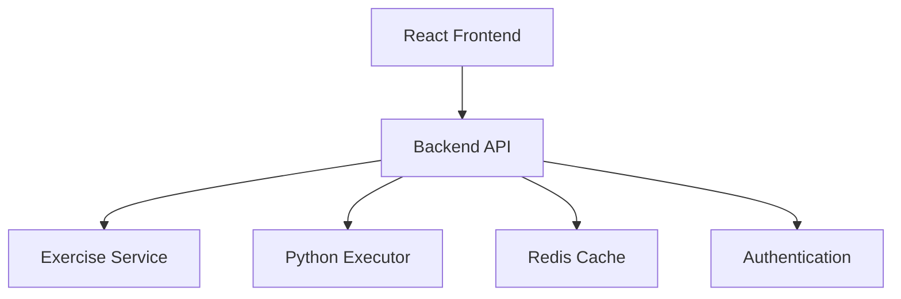

# Python Portal Backend API

## 🎯 Purpose

The `@python-portal/backend` package provides the main Express.js API server for the Python Portal learning platform. This microservice serves as the central API gateway, orchestrating communication between the frontend, exercise service, and execution service.

## 🏗️ Architecture

### Core Responsibilities
- **API Gateway**: Central entry point for all client requests
- **Authentication**: User session management and security
- **Data Aggregation**: Combining data from multiple services
- **Request Routing**: Intelligent routing to appropriate microservices
- **Response Transformation**: Standardizing API responses
- **Rate Limiting**: Protecting services from abuse
- **Monitoring**: Health checks and performance metrics

### Service Integration


## 🚀 Features

### Production-Ready API
- **OpenAPI 3.0 Specification**: Complete API documentation
- **RESTful Endpoints**: Standard HTTP methods and status codes
- **Request Validation**: Comprehensive input validation with Joi
- **Error Handling**: Structured error responses with correlation IDs
- **CORS Configuration**: Secure cross-origin resource sharing
- **Security Headers**: Helmet.js security middleware
- **Rate Limiting**: Configurable rate limiting per endpoint
- **Response Compression**: Gzip compression for optimal performance

### Microservice Communication
- **Service Discovery**: Dynamic service endpoint resolution
- **Circuit Breakers**: Fault tolerance for external service calls
- **Request Retry Logic**: Automatic retry with exponential backoff
- **Health Check Aggregation**: Monitoring all dependent services
- **Load Balancing**: Intelligent request distribution

### Caching Strategy
- **Redis Integration**: Distributed caching for scalability
- **Cache Invalidation**: Smart cache management
- **Session Storage**: User session persistence
- **Rate Limit Storage**: Distributed rate limiting

### Authentication & Authorization
- **JWT Tokens**: Secure stateless authentication
- **Guest Mode**: Anonymous user support
- **Role-Based Access**: Granular permission system
- **Session Management**: Secure session handling

## 📁 Project Structure

```
src/
├── controllers/         # Request handlers
│   ├── auth.controller.ts
│   ├── exercises.controller.ts
│   ├── execution.controller.ts
│   └── health.controller.ts
├── middleware/          # Express middleware
│   ├── auth.middleware.ts
│   ├── validation.middleware.ts
│   ├── error.middleware.ts
│   └── cors.middleware.ts
├── routes/             # Route definitions
│   ├── api.routes.ts
│   ├── auth.routes.ts
│   ├── exercises.routes.ts
│   └── health.routes.ts
├── services/           # Business logic
│   ├── exercise.service.ts
│   ├── execution.service.ts
│   ├── auth.service.ts
│   └── cache.service.ts
├── utils/              # Helper functions
│   ├── logger.ts
│   ├── validator.ts
│   └── response.ts
├── config/             # Configuration
│   ├── database.ts
│   ├── services.ts
│   └── swagger.ts
└── __tests__/          # Test files
    ├── controllers/
    ├── middleware/
    ├── routes/
    └── services/
```

## 🔧 Configuration

### Environment Variables
```bash
# Server Configuration
NODE_ENV=production
PORT=3001
API_VERSION=v1

# Service URLs
EXERCISES_SERVICE_URL=http://exercises:3003
EXECUTOR_SERVICE_URL=http://executor:3002
FRONTEND_URL=https://python-portal.com

# Security
JWT_SECRET=your-secret-key
JWT_EXPIRES_IN=24h
CORS_ORIGIN=https://python-portal.com

# Redis Configuration
REDIS_URL=redis://localhost:6379
REDIS_PASSWORD=optional-password

# Rate Limiting
RATE_LIMIT_WINDOW=900000  # 15 minutes
RATE_LIMIT_MAX=1000       # requests per window
RATE_LIMIT_AUTH_MAX=5000  # higher limit for authenticated users

# Monitoring
EEALTH_CHECK_TIMEOUT=5000
METRICS_ENABLED=true
LOG_LEVEL=info
```

### Docker Configuration
The service includes production-ready Docker configuration:
- Multi-stage build for optimal image size
- Non-root user for security
- Health checks for container orchestration
- Resource limits and monitoring

## 📚 API Documentation

### OpenAPI Specification
Complete API documentation is auto-generated from JSDoc comments:
```bash
npm run docs          # Generate OpenAPI spec
npm run docs:serve    # Serve interactive documentation
```

### Key Endpoints
```
GET  /api/v1/health              # Health check
POST /api/v1/auth/login          # User authentication
GET  /api/v1/exercises           # List exercises
GET  /api/v1/exercises/:id       # Get exercise details
POST /api/v1/execute             # Execute Python code
GET  /api/v1/progress            # User progress
POST /api/v1/progress            # Save progress
```

## 🧪 Testing

### Comprehensive Test Suite
- **Unit Tests**: Individual function testing
- **Integration Tests**: API endpoint testing
- **Service Tests**: External service integration
- **Security Tests**: Authentication and authorization
- **Performance Tests**: Load and stress testing

### Test Coverage
Maintains >90% code coverage across:
- Controllers and routes
- Middleware functions
- Service integrations
- Error handling paths

```bash
npm test              # Run all tests
npm run test:watch    # Watch mode
npm run test:coverage # Coverage report
```

## 🔒 Security

### Security Features
- **Helmet.js**: Security headers
- **CORS Protection**: Configurable cross-origin policies
- **Rate Limiting**: DDoS protection
- **Input Validation**: SQL injection prevention
- **JWT Security**: Token-based authentication
- **HTTPS Enforcement**: TLS/SSL requirements
- **Security Headers**: CSP, HSTS, X-Frame-Options

### Security Best Practices
- No hardcoded secrets
- Environment-based configuration
- Regular dependency updates
- Security audit logging
- Principle of least privilege

## 🚀 Deployment

### Production Deployment
```bash
# Build for production
npm run build

# Start production server
npm run start:prod

# Docker deployment
docker build -t python-portal-backend .
docker run -p 3001:3001 --env-file .env python-portal-backend
```

### Health Monitoring
The service provides comprehensive health endpoints:
- `/health` - Overall service health
- `/health/ready` - Readiness probe
- `/health/live` - Liveness probe
- `/metrics` - Performance metrics

## 📊 Performance

### Optimization Features
- **Response Compression**: Gzip compression
- **Caching Strategy**: Redis-based caching
- **Connection Pooling**: Efficient database connections
- **Request Deduplication**: Prevents duplicate requests
- **Lazy Loading**: On-demand resource loading

### Monitoring
- **Request Logging**: Morgan HTTP request logger
- **Error Tracking**: Structured error logging
- **Performance Metrics**: Response time monitoring
- **Health Checks**: Service dependency monitoring

## 🔧 Development

### Development Setup
```bash
# Install dependencies
npm install

# Start development server
npm run dev

# Run linting
npm run lint

# Type checking
npm run type-check
```

### Code Quality
- **TypeScript Strict Mode**: Maximum type safety
- **ESLint Airbnb Config**: Industry-standard linting
- **Prettier Integration**: Consistent code formatting
- **Pre-commit Hooks**: Automated quality checks

## 🤝 Integration

This package integrates seamlessly with other Python Portal services:
- **@python-portal/types**: Shared TypeScript definitions
- **@python-portal/exercises**: Exercise content service
- **@python-portal/executor**: Python execution service
- **@python-portal/frontend**: React application

## 📝 License

MIT License - see LICENSE file for details.

## 🆘 Support

For issues and support:
- GitHub Issues: [python-portal-backend/issues]
- Documentation: [API Documentation]
- Team Contact: Python Portal Development Team